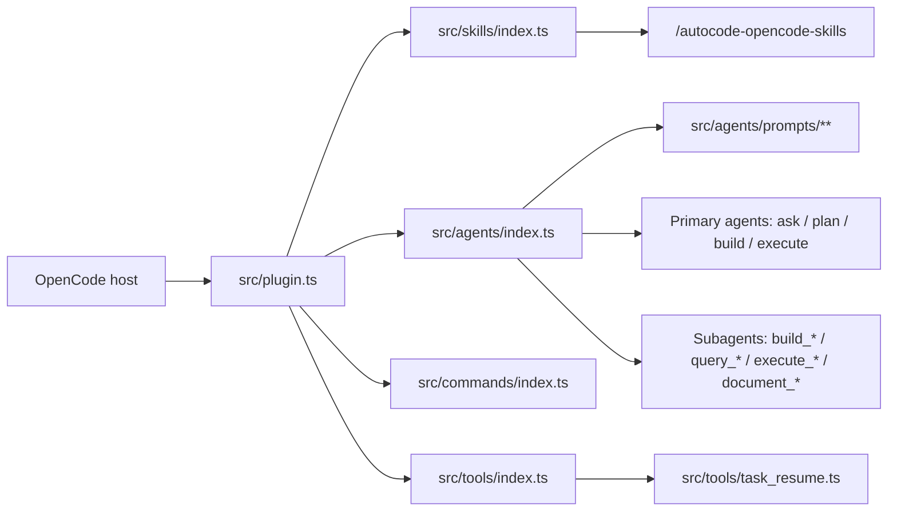

# Autocode OpenCode Plugin

Autocode is an OpenCode plugin/library that bundles agents, commands, and managed skills so users can plan, research, execute, review, and document work inside OpenCode instead of wiring those workflows by hand.

It solves that by injecting a curated default agent catalog, bundled commands, and generated `author_*` / `test_*` skills into OpenCode while still allowing user config to override the bundled defaults.

## Installation

### Prerequisites

1. Install **Bun** because all supported workflows use Bun commands.
2. Use **OpenCode with plugin support** because this repository is an OpenCode plugin/library, not a standalone app.

### Local Setup Steps

1. Install dependencies:
   ```bash
   bun install
   ```
2. Build the plugin:
   ```bash
   bun run build
   ```
3. Add the built plugin to `opencode.jsonc`:
   ```jsonc
   { "plugin": ["file:///absolute/path/to/auto-agents/dist/plugin.js"] }
   ```
4. For a published package install, use the package name:
   ```jsonc
   { "plugin": ["autocode"] }
   ```

### Startup Steps

1. During development, run:
   ```bash
   bun run watch
   ```
2. Start or reload OpenCode with the plugin configured.
3. On load, the plugin generates managed skills under your system temp directory in `autocode-opencode-skills` and prepends that path to `cfg.skills.paths`.
4. Use the primary agents: `ask`, `plan`, `build`, and `execute`.

## Usage

### Common Project Commands/URLs

```bash
bun run build
bun run watch
bun test
bun run typecheck
```

This project does not expose a standalone app URL.

### Common Usage

- Use `ask` for read-only research and reporting.
- Use `plan` to interview, research, and prepare plans before implementation.
- Use `build` after a plan is approved.
- Use `execute` for direct work that does not need planning.
- Use documentation flows through `execute_document` and `document_*` specialists.

## Deployment

### Packaging Steps

1. Install dependencies with `bun install`.
2. Build the package with `bun run build`.
3. Distribute the compiled plugin from `dist/plugin.js`.

Deployment steps for a standalone app are not applicable because this repository is a plugin/library.

## Architecture



`src/plugin.ts` is the entrypoint. It generates managed skills, prepends their temp directory to OpenCode skill paths, and merges bundled agents and commands into OpenCode config. The repo is prompt-driven: primary agents orchestrate work, while scoped subagents handle implementation, queries, execution, and documentation.

## Terminology

### Internal Acronyms

- PRD: product requirements document.

### Definitions

- **Primary agent**: direct user-facing agent like `ask`, `plan`, `build`, or `execute`.
- **Subagent**: delegated agent with `mode: "subagent"`.
- **Managed skill**: built-in skill from `src/skills/**` rendered to runtime `SKILL.md`.
- **Generated skills root**: temp directory `autocode-opencode-skills`.
- **Documentation agent**: `document_*` subagent with one assigned documentation area.
- **Agentic memory docs**: agent-maintained docs under `.opencode/skills/**`.
- **Dev shim**: `.opencode/plugin/autocode.ts` re-exporting `dist/plugin.js` for local development.
