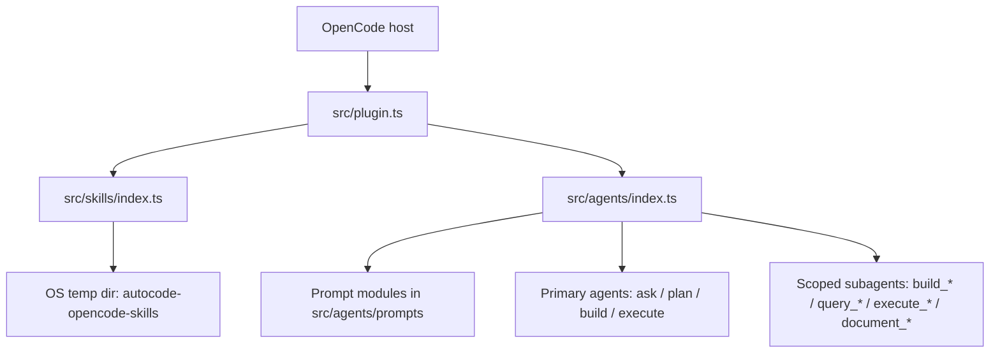
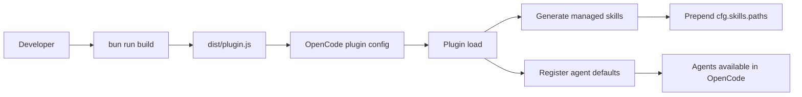

# Autocode OpenCode Plugin

OpenCode plugin that injects a curated agent catalog and generated skills for planning, delegation, execution, research, and documentation maintenance.

## Product Requirements

- Product scope: this repository ships an OpenCode plugin/library, not a standalone app or server.
- Primary user-facing agents are `ask`, `plan`, `build`, and `execute`.
- `plan` interviews the user, researches context, and prepares implementation plans before work begins.
- `build` executes an approved plan by delegating phases to specialized `build_*` supervisors.
- `execute` is the direct-action router for non-planning work.
- Documentation maintenance flows through `execute_document` into `document_*` specialists, with `document_readme` intended to run last.
- Verification is part of the operating model: review and feature agents should confirm outcomes with concrete evidence instead of asserting success without proof.
- The plugin also injects managed author/test skills generated from `src/skills/*` at runtime.

## Installation & Usage

See [INSTALL.md](INSTALL.md) for the full setup guide.

### Quick start

1. Install dependencies: `bun install`
2. Build the plugin: `bun run build`
3. Register `dist/plugin.js` in OpenCode via `opencode.jsonc`
4. Load the plugin in OpenCode and use the primary agents

### Typical usage flow

- Use `plan` for scoped implementation planning and approval-oriented workflows.
- Use `build` after a plan is approved.
- Use `execute` for direct work that does not need planning.
- Use `ask` for research-oriented, read-only reporting.

### Main commands

- `bun run build`
- `bun run watch`
- `bun test`
- `bun run typecheck`

## Ux

This project does not include a frontend application or browser UI.

- No router, pages, or component tree were found.
- No stylesheet system or frontend framework was found.
- UX here is prompt and workflow design for OpenCode agents rather than visual interface behavior.

## Design

This codebase is primarily a configuration-injection plugin plus a prompt catalog.

### Architecture overview

### Integration flow

### Confirmed design points

- `src/plugin.ts` merges bundled agent definitions into `cfg.agent` and injects the generated skills path into `cfg.skills.paths`.
- `src/agents/index.ts` is the core registry for agent names, prompts, tiers, colors, and permissions.
- The system is prompt-driven: orchestration lives mostly in agent configuration and prompt specialization, not in a large imperative runtime.
- Managed skills are materialized under the system temp directory as `autocode-opencode-skills/.../SKILL.md`.
- Tests currently focus on generated skill rendering/path injection, not end-to-end runtime behavior.

## Security

See [SECURITY.md](SECURITY.md) for the detailed security architecture.

- Security is permission-centric rather than auth-centric.
- Most agents are deny-by-default and receive scoped allowlists.
- User OpenCode config can override bundled agent definitions, including permissions.
- `query_browser` is intended for read-only browser inspection with manual user-managed login.
- `execute_os` has comparatively broad filesystem and shell access and deserves extra review in higher-trust environments.

## Conventions

- Top-level user-facing agents: `ask`, `plan`, `build`, `execute`.
- Specialist families use meaningful snake_case prefixes: `build_*`, `query_*`, `execute_*`, `document_*`.
- Documentation ownership maps directly from `document_<topic>` to `.opencode/skills/plan/<topic>/SKILL.md`.
- Managed skill names use domain/topic naming such as `author_article` and `test_jest`.
- Tier labels use `smart`, `balanced`, and `fast`.
- Agent colors roughly signal role: green for read-only, red for writable executors, blue/purple tones for orchestrators.
